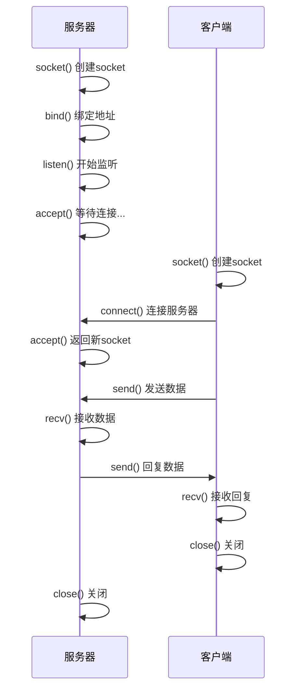
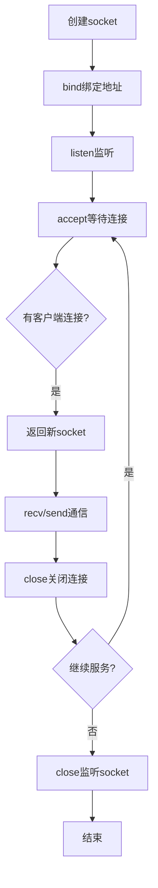

# Linux网络编程Day1：从零实现TCP通信

> 时间：2025年10月21日  
> 目标：搞懂socket是啥，写出能跑的TCP通信代码  
> 代码量：130行左右  
> 学习时长：2小时

---

## 📋 目录

- [为什么要学这个](#为什么要学这个)
- [从一个问题开始：两个程序怎么通信](#从一个问题开始两个程序怎么通信)
- [什么是socket](#什么是socket)
- [TCP vs UDP：我只需要知道这些](#tcp-vs-udp我只需要知道这些)
- [动手写代码1：创建第一个socket](#动手写代码1创建第一个socket)
- [服务器 vs 客户端：谁主动谁被动](#服务器-vs-客户端谁主动谁被动)
- [动手写代码2：TCP服务器](#动手写代码2tcp服务器)
- [动手写代码3：TCP客户端](#动手写代码3tcp客户端)
- [双向通信：让服务器回话](#双向通信让服务器回话)
- [遇到的坑](#遇到的坑)
- [今天学到了啥](#今天学到了啥)
- [明天干啥](#明天干啥)

---

## 为什么要学这个

十一月要开始做cpp-chat项目，一个聊天系统的后端。但是我发现自己对socket、epoll这些概念很模糊，之前学过但都忘了（记忆力确实不太好）。

所以决定从头开始，边做边学，这样记得牢。

今天的目标很简单：**让两个程序能互相发消息**。

---

## 从一个问题开始：两个程序怎么通信

假设我有两个C++程序：

```cpp
// 程序A
int main() {
    // 我想给程序B发消息："Hello"
    // 怎么发？？？
}
```

```cpp
// 程序B
int main() {
    // 我想接收程序A的消息
    // 怎么收？？？
}
```

### 如果用文件行不行？

我第一反应是：用文件呗！

```cpp
// 程序A写文件
FILE* f = fopen("/tmp/msg.txt", "w");
fprintf(f, "Hello");
fclose(f);

// 程序B读文件
FILE* f = fopen("/tmp/msg.txt", "r");
char buf[100];
fgets(buf, 100, f);
```

看起来行，但问题是：

1. **程序B怎么知道什么时候去读？** 一直轮询吗？那CPU不得炸了？
2. **如果两个程序在不同电脑上呢？** 北京的`/tmp/msg.txt`和上海的`/tmp/msg.txt`不是同一个文件啊！

所以文件不行。

### 跨网络通信需要什么？

- 知道对方的**IP地址**（找到对方的电脑）
- 知道对方的**端口号**（找到对方电脑上的具体程序）

那怎么用C++代码实现"通过网络发送数据"呢？

**答案：socket**

---

## 什么是socket

socket就是**网络通信的"文件描述符"**。

文件操作是这样的：

```cpp
int fd = open("/tmp/file.txt", O_RDWR);  // 打开文件
write(fd, "Hello", 5);                    // 写数据
read(fd, buf, 100);                       // 读数据
close(fd);                                // 关闭
```

socket也类似：

```cpp
int sock = socket(...);      // 创建"网络文件"
// ... 连接到对方
write(sock, "Hello", 5);     // 发送数据（也可以用send）
read(sock, buf, 100);        // 接收数据（也可以用recv）
close(sock);                 // 关闭连接
```

**核心概念：在Linux里，一切皆文件，socket也是文件！**

所以socket返回的也是一个文件描述符（fd）。

---

## TCP vs UDP：我只需要知道这些

网络传输有两种方式：TCP和UDP。

**用寄快递来类比：**

### TCP = 顺丰快递
- ✅ 保证送达（丢了赔钱）
- ✅ 保证顺序（今天寄的不会比昨天的先到）
- ✅ 保证完整（不会少东西）
- ✅ 有确认机制（签收单）
- ❌ 慢一点（需要签收、确认）

**用在哪？** 聊天（微信）、文件传输、网页浏览

### UDP = 往楼下扔纸条
- ✅ 快（扔下去就完事）
- ❌ 不保证送达（可能被风吹走）
- ❌ 不保证顺序
- ❌ 不保证完整

**用在哪？** 视频直播、语音通话、游戏

**我的cpp-chat项目用TCP就够了。**

TCP就像打电话：
1. 先拨号（建立连接）
2. 互相说话（收发数据）
3. 挂电话（断开连接）

---

## 动手写代码1：创建第一个socket

第一步：先创建一个socket，看看长啥样。

```cpp
// test_socket.cpp
#include <sys/socket.h>
#include <stdio.h>
#include <unistd.h>

int main() {
    // 创建一个TCP socket（IPv4）
    int sock = socket(AF_INET, SOCK_STREAM, 0);
    
    if (sock < 0) {
        perror("socket创建失败");
        return 1;
    }
    
    printf("成功创建socket，文件描述符：%d\n", sock);
    
    close(sock);
    return 0;
}
```

### socket函数的三个参数：

```cpp
int sock = socket(
    AF_INET,      // IPv4（AF_INET6就是IPv6）
    SOCK_STREAM,  // TCP（SOCK_DGRAM就是UDP）
    0             // 协议（写0让系统自动选）
);
```

### 编译运行：

```bash
g++ test_socket.cpp -o test_socket
./test_socket
```

**运行结果：**

```
成功创建socket，文件描述符：3
```

**为什么是3？** 因为0、1、2分别是stdin、stdout、stderr，所以socket从3开始。

**[截图1：test_socket运行结果]**

---

## 服务器 vs 客户端：谁主动谁被动

现在有socket了，但还没有连接到任何地方。

**就像你有了手机，但还没拨号。**

### 思考：两个程序都主动连接对方行吗？

不行！会出现这个情况：

```
程序A："我要连接你！但你的地址是啥？"
程序B："我要连接你！但你的地址是啥？"
→ 都不知道对方地址，连不上！
```

**正确方式：**

```
程序A（服务器）："我在这里等着，地址是127.0.0.1:8080"
程序B（客户端）："好，我连接你127.0.0.1:8080"
→ 连接成功！
```

### 两种角色：

**服务器（被动等待）：**
1. 创建socket
2. 绑定地址（bind）："我在192.168.1.100:8080等着"
3. 监听（listen）："开始接电话了"
4. 接受连接（accept）："有电话打进来，接听！"
5. 通信（recv/send）

**客户端（主动连接）：**
1. 创建socket
2. 连接服务器（connect）："拨号到192.168.1.100:8080"
3. 通信（send/recv）

**我决定先写服务器。**

### 通信流程图：



---

## 动手写代码2：TCP服务器

完整代码：

```cpp
// tcp_server.cpp
#include <sys/socket.h>
#include <netinet/in.h>
#include <arpa/inet.h>
#include <stdio.h>
#include <unistd.h>
#include <string.h>

int main() {
    // 1. 创建socket
    int listen_sock = socket(AF_INET, SOCK_STREAM, 0);
    if (listen_sock < 0) {
        perror("socket create failed");
        return 1;
    }
    printf("socket create success, 文件描述符fd = %d\n", listen_sock);

    // 2. 绑定地址（bind）
    struct sockaddr_in addr;
    memset(&addr, 0, sizeof(addr));
    
    addr.sin_family = AF_INET;              // IPv4
    addr.sin_port = htons(8080);            // 端口8080（网络字节序）
    addr.sin_addr.s_addr = INADDR_ANY;      // 0.0.0.0（监听所有网卡）
    
    int ret = bind(listen_sock, (struct sockaddr*)&addr, sizeof(addr));
    if (ret < 0) {
        perror("bind failed");
        return 1;
    }
    printf("bind success，监听端口：8080\n");
    
    // 3. 监听（listen）
    ret = listen(listen_sock, 128);
    if (ret < 0) {
        perror("listen");
        return 1;
    }
    printf("listen success，开始监听端口：8080\n");
    
    // 4. 接受连接（accept）
    printf("等待客户端连接...\n");
    
    struct sockaddr_in client_addr;
    socklen_t client_len = sizeof(client_addr);
    
    int client_sock = accept(listen_sock, (struct sockaddr*)&client_addr, &client_len);
    if (client_sock < 0) {
        perror("accept");
        return 1;
    }
    printf("客户端连接成功，客户端IP：%s，客户端端口：%d\n", 
           inet_ntoa(client_addr.sin_addr), ntohs(client_addr.sin_port));
    
    // 5. 接收消息
    char buf[1024];
    ssize_t n = recv(client_sock, buf, sizeof(buf)-1, 0);
    if (n > 0) {
        buf[n] = '\0';
        printf("5. 收到客户端消息：%s\n", buf);
        
        // 6. 回复客户端
        const char* reply = "Hello, Client! 我收到你的消息了！";
        send(client_sock, reply, strlen(reply), 0);
        printf("6. 回复客户端：%s\n", reply);
    }
    
    close(client_sock);
    close(listen_sock);
    return 0;
}
```

### 几个关键点：

#### 2.1 bind - 绑定地址

```cpp
struct sockaddr_in addr;
addr.sin_family = AF_INET;           // IPv4地址族
addr.sin_port = htons(8080);         // 端口（host to network short）
addr.sin_addr.s_addr = INADDR_ANY;   // 0.0.0.0
```

**为什么用`INADDR_ANY`而不是`127.0.0.1`？**

- `127.0.0.1` = 只能本机连接
- `INADDR_ANY` = 所有网卡都能连（本机、局域网、公网都行）

**`htons`是什么？**

host to network short，把端口号转成网络字节序。暂时不用深究，记住端口号要用`htons()`就行。

#### 2.2 listen - 开始监听

```cpp
listen(listen_sock, 128);
```

`128`表示等待队列的最大长度。就像餐厅最多让128个客人排队等位，第129个就被拒绝。

#### 2.3 accept - 接受连接

```cpp
int client_sock = accept(listen_sock, ...);
```

**重要：** `accept`会返回一个**新的socket**！

- `listen_sock`（fd=3）：监听socket，专门用来接待客人
- `client_sock`（fd=4）：连接socket，用来和具体客户通信

**而且，accept会阻塞！** 没有客户端连接时，程序会停在这里等待（不占CPU）。

### 编译运行：

```bash
g++ tcp_server.cpp -o server
./server
```

**运行结果：**

```
socket create success, 文件描述符fd = 3
bind success，监听端口：8080
listen success，开始监听端口：8080
等待客户端连接...
（程序停在这里，等待客户端）
```

**[截图2：服务器等待连接]**

---

## 动手写代码3：TCP客户端

完整代码：

```cpp
// tcp_client.cpp
#include <sys/socket.h>
#include <netinet/in.h>
#include <arpa/inet.h>
#include <stdio.h>
#include <unistd.h>
#include <string.h>

int main() {
    // 1. 创建socket
    int sock = socket(AF_INET, SOCK_STREAM, 0);
    if (sock < 0) {
        perror("socket");
        return 1;
    }
    printf("1. socket创建成功, fd = %d\n", sock);
    
    // 2. 连接服务器（connect）
    struct sockaddr_in server_addr;
    memset(&server_addr, 0, sizeof(server_addr));
    
    server_addr.sin_family = AF_INET;                    // IPv4
    server_addr.sin_port = htons(8080);                  // 服务器端口
    server_addr.sin_addr.s_addr = inet_addr("127.0.0.1"); // 服务器IP
    
    int ret = connect(sock, (struct sockaddr*)&server_addr, sizeof(server_addr));
    if (ret < 0) {
        perror("connect");
        return 1;
    }
    printf("2. 连接服务器成功！\n");
    
    // 3. 发送消息
    const char* msg = "Hello, Server! 我是客户端！";
    send(sock, msg, strlen(msg), 0);
    printf("3. 发送消息：%s\n", msg);
    
    // 4. 接收服务器回复
    char buf[1024];
    ssize_t n = recv(sock, buf, sizeof(buf)-1, 0);
    if (n > 0) {
        buf[n] = '\0';
        printf("4. 收到服务器回复：%s\n", buf);
    }
    
    close(sock);
    return 0;
}
```

### 关键点：

#### 3.1 connect - 连接服务器

```cpp
server_addr.sin_addr.s_addr = inet_addr("127.0.0.1");
connect(sock, (struct sockaddr*)&server_addr, sizeof(server_addr));
```

`connect()`会主动连接服务器，成功后就建立了TCP连接（三次握手完成）。

#### 3.2 send/recv - 收发数据

```cpp
send(sock, msg, strlen(msg), 0);  // 发送
recv(sock, buf, sizeof(buf)-1, 0); // 接收
```

也可以用`write()`和`read()`，效果一样。

### 编译运行：

**保持服务器运行，另开一个终端：**

```bash
g++ tcp_client.cpp -o client
./client
```

**客户端输出：**

```
1. socket创建成功, fd = 3
2. 连接服务器成功！
3. 发送消息：Hello, Server! 我是客户端！
4. 收到服务器回复：Hello, Client! 我收到你的消息了！
```

**[截图3：客户端运行结果]**

**服务器输出：**

```
等待客户端连接...
客户端连接成功，客户端IP：127.0.0.1，客户端端口：40498
5. 收到客户端消息：Hello, Server! 我是客户端！
6. 回复客户端：Hello, Client! 我收到你的消息了！
```

**[截图4：服务器收到消息并回复]**

---

## 双向通信：让服务器回话

最开始只实现了单向通信（客户端 → 服务器），后来加了服务器回复。

核心就是：

```cpp
// 服务器端
recv(client_sock, buf, ...);  // 接收
send(client_sock, reply, ...); // 回复

// 客户端
send(sock, msg, ...);     // 发送
recv(sock, buf, ...);     // 接收回复
```

没什么特别的，send和recv都能用。

---

## 遇到的坑

### 坑1：编译错误 - 找不到inet_ntoa

```
error: 'inet_ntoa' was not declared in this scope
```

**原因：** 缺少头文件

**解决：** 加上`#include <arpa/inet.h>`

### 坑2：编译错误 - undefined reference to main

**原因：** 文件没保存！

**解决：** Ctrl+S保存后重新编译

### 坑3：不理解accept的参数

```cpp
accept(listen_sock, (struct sockaddr*)&client_addr, &client_len);
```

**暂时不用深究！** 用几次就熟悉了。实在不懂可以查`man accept`。

### 坑4：很多函数记不住

第一天不需要记。多写几次自然就记住了。

记不住就查：
- Google
- man手册（`man socket`、`man bind`等）
- 问AI

---

## 今天学到了啥

### 核心概念：

1. **socket = 网络通信的文件描述符**
   - 可以像操作文件一样操作socket
   
2. **TCP = 可靠传输（像打电话）**
   - 需要先建立连接
   - 保证数据送达、有序、完整

3. **服务器 vs 客户端**
   - 服务器：被动等待（bind → listen → accept）
   - 客户端：主动连接（connect）

### 核心流程：

```
服务器：socket → bind → listen → accept → recv/send
客户端：socket → connect → send/recv
```

**服务器状态转换图：**



### 代码成果：

```
test_socket.cpp   → 创建socket
tcp_server.cpp    → TCP服务器（64行）
tcp_client.cpp    → TCP客户端（47行）
总计：~130行
```

### 最重要的收获：

理解了TCP通信的完整流程，代码能跑通了。 ✅

---

## 明天干啥

1. **实现完整的Echo服务器**
   - 客户端发什么，服务器原样返回
   - 支持多次收发（循环）

2. **处理断开连接**
   - 客户端断开时服务器怎么处理
   - close的时机

3. **错误处理**
   - 各种异常情况的处理

4. **思考：怎么支持多个客户端？**
   - 现在只能一次处理一个客户端
   - 多个客户端需要什么技术？（预告：多线程、epoll）

---

**下一篇：** 《Linux网络编程Day2：实现Echo服务器》

---

> 2025.10.21  
> 学习时长：2小时  
> 代码量：130行  
> 收获：理解TCP通信流程，代码能跑通 ✅

